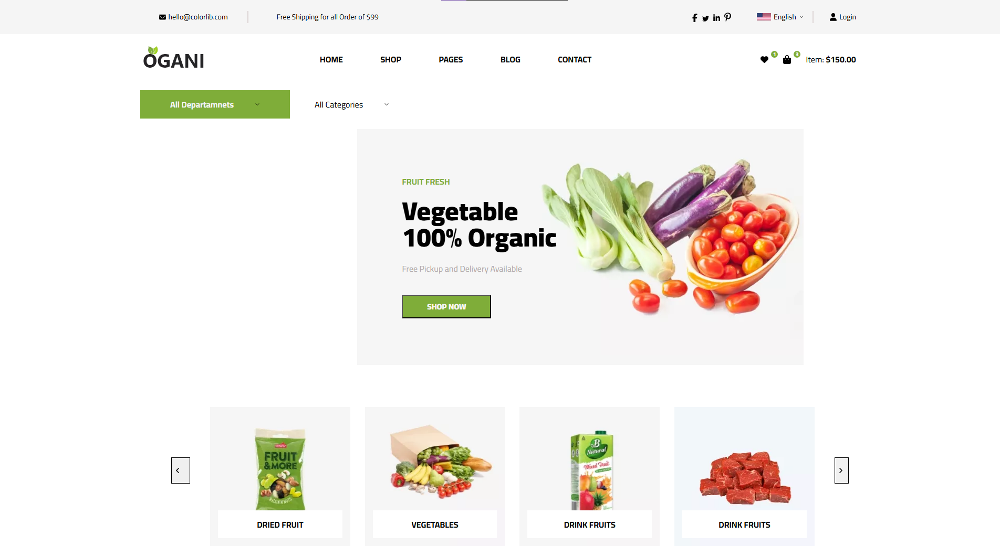

# ​ Ogani — Template de Site

> Projeto desenvolvido como atividade acadêmica para o curso de **Front‑End** no COTEMIG.

---

##  Sobre o Projeto

Ogani é um template de site simulado para e‑commerce de produtos orgânicos, como frutas, legumes, alimentos secos e frescos. Criado para demonstrar habilidades em design responsivo, layout de categoria de produtos e apresentação visual de itens em destaque.

---

##  Funcionalidades Simuladas

-  Exibição de categorias de produtos: "Fresh Meat", "Vegetables", "Fruit & Nut Gifts", "Fresh Berries", entre outras.
-  Seção "Featured Product" com produtos fictícios e preços exibidos.
-  Seção "Latest Products" para mostrar itens mais recentes (também simulados).
-  Navegação visual com imagens e estrutura de e‑commerce básica (sem funcionalidade de carrinho ou backend real).

---

##  Tecnologias Utilizadas

- HTML & CSS modernos
- Layout responsivo (grid ou flexbox), compatível com diferentes tamanhos de tela
- Design voltado para usabilidade e domínio de componentes visuais de um e‑commerce

---

##  Visual do Projeto

O design do site remete a um típico e‑commerce de produtos naturais. A homepage exibe:

- Um banner ou lista de categorias na parte superior (por exemplo: “Fresh Onions”, “Oatmeal”, “Fresh Bananas”).
- Uma seção “Featured Product” com vários itens fictícios (como "Crab Pool Security" com preço de $30).
- Uma seção “Latest Products” com imagens indicativas de produtos recentes.

---

##  Objetivos Educacionais

- Aplicar técnicas de desenvolvimento Front‑End aprendidas no curso.
- Explorar layout de e‑commerce, organização de seções visuais e responsividade.
- Criar um protótipo visual atraente mesmo sem backend funcional.

---

## 📷 Visual do Projeto

Você pode acessar o site hospedado no GitHub Pages através deste link:

[Ogani — Template de Site](https://cristalfigueiredoo.github.io/Organi-Templade-Site/)

---

_Obs.: Este site foi criado com fins exclusivamente acadêmicos como parte da disciplina de **Front‑End** e não possui funcionalidades interativas ou back‑end operacional._

